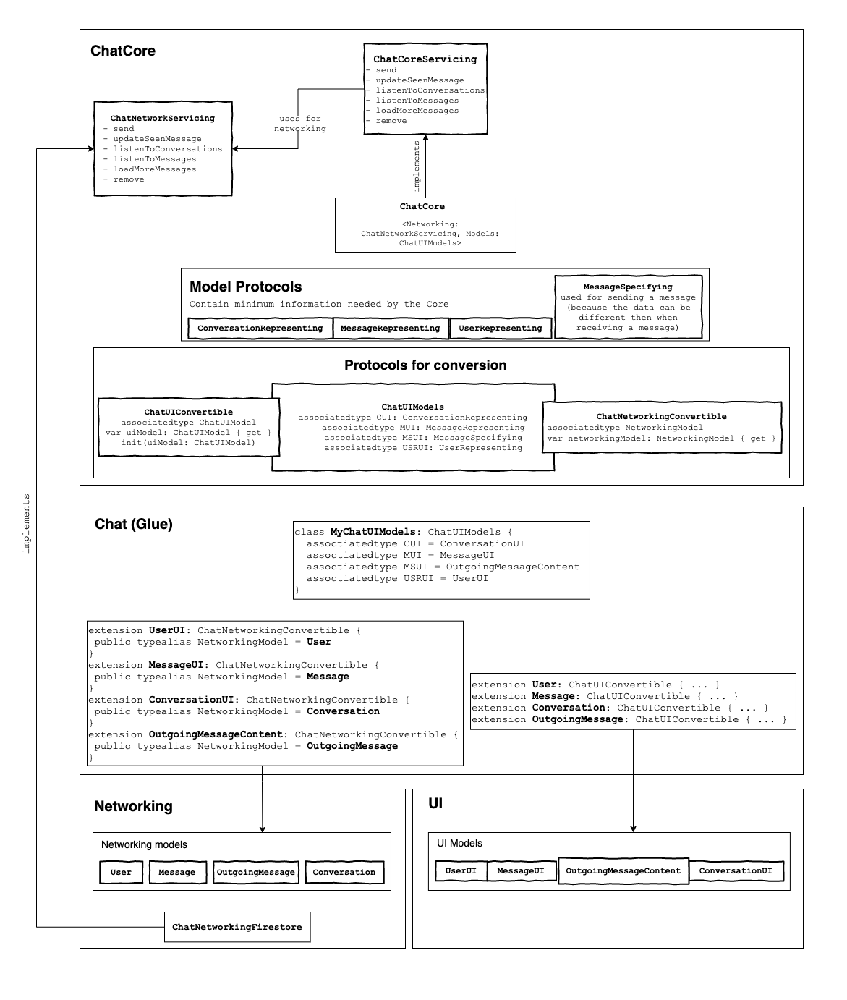

# STRVChatKit <a href="https://developer.apple.com/swift/"></a>

* [Description](#description)
* [Installation](#installation)
* [Architecture](#architecture)
* [Writing custom UI layer](#writing-custom-ui-layer)
* [Writing custom networking layer](#writing-custom-networking-layer)
* [Gluing UI layer and networking layer](#gluing-ui-layer-and-networking-layer)
* [Usage](#chat-core-usage)
  * [Listeners](#listeners)
  * [Send a message](#send-a-message)
  * [Listen to conversations](#listen-to-conversations)
  * [Listen to messages](#listen-to-messages)
  * [Pagination](#pagination)

## Description

This repository contains an universal chat framework that can be easily scaled to be used in any project that contains standard in-app chat component. This library is divided into multiple modules (layers). Each module is a standalone framework target, so the implementation details can be hidden from each others with the `internal` modifier. Each module is its own pod as well.

## Installation

### CocoaPods

As we are currently working with a private repository, podspecs of each layer are in a separate repository right [here](https://github.com/strvcom/ios-research-chat-component-specs)

To integrate Chat Component into your Xcode project using CocoaPods, specify it in your `Podfile`. Do not forget to include source path to the private repo with podspecs. You also must be logged into your Github account to have access to the private repos:
```
source 'https://github.com/strvcom/ios-research-chat-component-specs.git'
source 'https://github.com/CocoaPods/Specs.git'

target 'TARGET_NAME' do
  # For plug&play solution with predefined MessageKit UI and Firestore backend
  pod 'Chat/ChatMessageKitFirestore'

  # If you want to use just some of the layers
  pod 'Chat/Core'
  pod 'Chat/NetworkingFirestore'
  pod 'Chat/UI'
end
```

## Example

See the [sample app](ChatApp/) for an example how to use this pod.

## Architecture

The library consists of four modules:
* Chat
* ChatCore
* ChatNetworkingFirestore 
* ChatUI

See this diagram for a visual overview of the architecture:



### ChatCore - Essential models and protocols

#### `ChatCore`

The main class that the UI can use for all chat operations. It contains all the necessary methods and implements `ChatCoreServicing` protocol.

#### `DataPayload`

This class carries the data received from a listener (for example collection of conversations) plus the information whether end of the data has been reached. This is useful for the UI to be able to hide "Load more" button for example. It could possibly contain some more meta data in the future.

### ChatNetworkingFirestore - Firestore networking layer (optional)

You can use this pod if your project uses Firestore as the database for the chat. If you need to use another API, you can write your own networking layer. See [Writing custom networking layer](#writing-custom-networking-layer)

### ChatUI - UI using MessageKit (optional)

Simple UI implementation for testing. Most projects will probably want to write their own UI. See [Writing custom UI layer](#writing-custom-ui-layer).

### Chat – Glue
You can use this part of the library in case you want to use both ChatNetworkingFirestore and ChatUI and don't need anything custom. It contains the glue code necessary for all of the parts to work. If you use custom UI or networking layer, you will have to write this yourself – it's very simple though. See [Gluing UI layer and networking layer](#gluing-ui-layer-and-networking-layer)

## Writing custom UI layer

The provided UI layer is fairly simple and doesn't offer any customization so usually in a project you will want to create you own UI layer. The only thing that is required is providing the `ChatCore` class with a `ChatUIModels` implementation that specifies which models should be provided to your completion handlers. 

```swift 
class ChatCore<Networking: ChatNetworkServicing, Models: ChatUIModels>: ChatCoreServicing
```

``` swift
public protocol ChatUIModels {
    associatedtype CUI: ConversationRepresenting
    associatedtype MUI: MessageRepresenting
    associatedtype MSUI: MessageSpecifying
    associatedtype USRUI: UserRepresenting
}
```

## Writing custom networking layer

The only thing needed to implement custom networking layer is conforming to the protocol `ChatNetworkServicing` and providing this implementation to `ChatCore` as seen in the next chapter.

## Gluing UI layer and networking layer

Let's take the Chat module mentioned above as an example.

First, you need to make all your networking models conform to `ChatUIConvertible`, for example:

``` swift
extension ConversationFirestore: ChatUIConvertible {
    public var uiModel: Conversation {
      // return Conversation instance created using data from `self`
    }

    public init(uiModel: Conversation) {
      // call self.init using data from `uiModel`
    }
}
```

and make all your UI models conform to `ChatNetworkingConvertible` like this:

```swift
extension Conversation: ChatNetworkingConvertible {
    public typealias NetworkingModel = ConversationFirestore
}
```

Second step is to instantiate `ChatCore` class.

The main [`Chat`](Chat/Chat.swift) class in this example instantiates the whole mechanism like this:

``` swift
let interface: ChatUI<ChatCore<ChatNetworkFirebase, ChatModelsUI>>

public init(config: Configuration) {
    let networking = ChatNetworkFirebase(config: config)
    let core = ChatCore<ChatNetworkFirebase, ChatModelsUI>(networking: networking)
    self.interface = ChatUI(core: core)
}
```

In order to use `ChatCore` service in another class (for example a controller) as a `ChatCoreServicing` type it is necessary to use the `ChatCoreServicing` protocol as a generic constraint for that class and specify UIModels in the constraints.

In this case, the class `ChatUI` specializes the `ChatCoreServicing` protocol to specify UIModels like this:

``` swift
public class ChatUI<Core: ChatUICoreServicing>: ChatUIServicing {
  ...
}

public protocol ChatUICoreServicing: ChatCoreServicing where C == Conversation, M == MessageKitType, MS == MessageSpecification, U == User { }

extension ChatCore: ChatUICoreServicing where Models.CUI == Conversation, Models.MSUI == MessageSpecification, Models.MUI == MessageKitType, Models.USRUI == User { }
```

and then it's used in a controller like this:

``` swift
public class ConversationsListViewController<Core: ChatUICoreServicing>: UIViewController {
    let core: Core
    ...
}
```

## Chat core usage

### Listeners

Because chat is a real-time functionality, the client needs to be notified about any new data updates ASAP. That's why fetching conversations and messages is done using a persistent connection. Every time you call `core.listenToConversations` or `core.listenToMessages` you receive a `ChatListener` (just a `String` typealias for now) instance that you must store somewhere. Whenever you are ready to stop listening to this particular set of data, call `core.remove(listener: ChatListener)` so there is no unnecessary network connection left behind.

### Send a message
``` swift
core.send(message: .text(message: "Hello!"), to: currentChatId) { result in

    // Called after successfuly sending a message

    switch result {
    case .success(let message):
        print(message.id)
    case .failure(let error):
        print(error)
    }
}
```
### Listen to conversations

``` swift
core.listenToConversations { result in

    // Called on every conversations update

    switch result {
    case .success(let payload):
        // payload contains current list of fetched conversations
        // as well as some additional data (see `DataPayload` for more info)
    case .failure(let error):
        print(error)
    }
}
```

### Listen to messages of a conversation

``` swift
core.listenToMessages(conversation: conversationId) { result in

    // Called on every messages update
    
    switch result {
    case .success(let payload):
        // payload contains current list of fetched conversations
        // as well as some additional data (see `DataPayload` for more info)
    case .failure(let error):
        print(error)
    }
}
```

### Pagination

Whenever you need to load next page of conversations or messages, simply call `core.loadMoreConversations` or `core.loadMoreMessages` respectively. The existing callbacks that you provided when calling `core.listenTo...` method will be called with updated set of data. (So on the first call to `core.listenToConversations` you will receive 1 &ast; n number of conversations and after calling `core.loadMoreConversations` you will receive 2 &ast; n number of conversations).

## Features

### Conversation

- [X] Open a public one-to-many conversation
- [X] List of conversations
- [ ] Open a private conversation
- [ ] Open a private one-to-one conversation
- [ ] Get notified when conversations are updated
- [ ] Implement background fetch for retry mechanism
- [ ] Online status indicator

### Message

- [X] Get notified when create/update messages
- [X] Read receipts - show a flag with a time and date next to a last message the other user read
- [ ] Cache messages that failed to be sent
- [ ] Retry mechanism for sending messages
- [ ] Continue with sending a message even if user sends an app to background

### User

- [ ] Name
- [ ] Avatar
  
### Supported Message Types

- [X] Text
- [X] Photo
- [ ] Video
- [ ] Location
 
## Future features

**These features will be added in later stages of development but the framework must be developed with bearing them in mind.**

- [ ] Persistence
- [ ] Moderation
- [ ] Extensions - RxSwift, PromiseKit...etc
- [ ] Typing indicator
- [ ] Notifications

## References

### Existing Solutions

- Sendbird [docs](https://docs.sendbird.com/)
- ~~Layer [docs](https://docs.layer.com/)~~ shutdown

### Open Source UI Components used in the pod

- [MessageKit](https://github.com/MessageKit/MessageKit)

## Publishing new version

As we work with private repos, also the publishing is more complicated. But not too much. You also must be logged into your Github account to have access to the private repos. Then you need to add the private pods to your local specs like this:

```
pod repo add Chat https://github.com/strvcom/ios-research-chat-component-specs.git
pod repo add ChatCore https://github.com/strvcom/ios-research-chat-component-specs.git
pod repo add ChatUI https://github.com/strvcom/ios-research-chat-component-specs.git
pod repo add ChatNetworkingFirestore https://github.com/strvcom/ios-research-chat-component-specs.git
```

This should be done only once.

When you want to release a new version of a pod, first, you need to push your code with a tag describing the version number, let's say `1.1.0`.

Let's assume you updated `ChatCore`. So you need to get `ChatCore.podspec` from the specs repository and locally update version number to `1.1.0` in the file. Finally, you have to push the changes in specs to the specs repository like this:

```
pod repo push ChatCore ~/Desktop/ChatCore.podspec
```

And that's it. You can check complete [Podspec docs](https://guides.cocoapods.org/syntax/podspec.html) and [Private Pod docs](https://guides.cocoapods.org/making/private-cocoapods.html).

## Notes
The solution should be as modular and as scalable as possible. In the first phase a conversation can be created just for two users, but the framework should account with a future multichat support. Because chat is a realtime feature it should support realtime communication and animated UI updates.

The framework shouldn't be dependent on any 3rd party library including frameworks for reactive programming. A reactive wrapper can be created during a future development.

<!-- The framework should have at least 3 separate modules:

1. Interchangeable UI layer
2. Universal business logic layer (can be split into more modules)
3. Interchangeable networking layer -->

The interfaces between layers should be designed as universal as possible. Please bear in mind that the networking layer should be interchangeable so it shouldn't matter if it is connected to REST API or a Firebase instance. A similar statement holds for the first layer; it shouldn't matter if the UI layer uses a table view or collection view for showing messages.